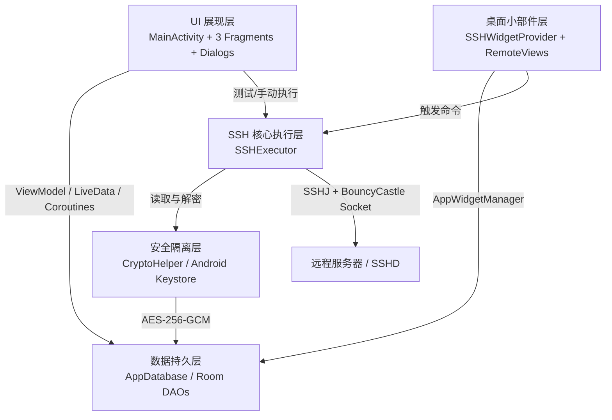
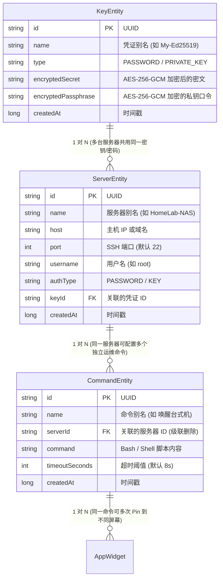
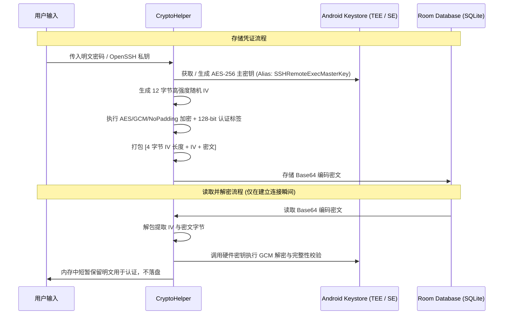
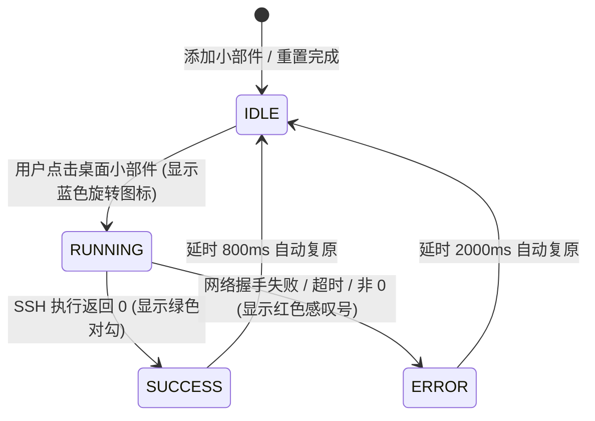

# 系统架构设计与数据流 (Architecture & Data Flow)

[返回开发文档目录](README.md)

---

## 1. 架构总览

`SSH Remote Exec` 采用 **Material Design 3 + Single Activity + Jetpack Room + Coroutines** 的现代原生 Android 架构。项目划分为以下核心层级：



---

## 2. 三层解耦实体设计 (Decoupled Entity Model)

项目设计摒弃了“服务器配置硬编码凭据与命令”的紧耦合方案，采用高内聚、低耦合的三层实体模型：



### 实体间级联删除机制
在 `CommandEntity` 中定义了 Room 的级联外键：
```kotlin
ForeignKey(
    entity = ServerEntity::class,
    parentColumns = ["id"],
    childColumns = ["serverId"],
    onDelete = ForeignKey.CASCADE
)
```
- **删除服务器时**：数据库自动级联删除其下的所有命令，避免产生孤立悬空命令。
- **删除凭据时**：保留关联服务器，界面提示用户重新关联有效凭证，防止误删服务器导致历史命令丢失。

---

## 3. 安全隔离层：硬件级 Android Keystore 加密

针对私钥与明文密码的存储安全，项目拒绝采用明文或对称硬编码密钥方案，实现了严格的硬件级加密隔离：

### 加密流水线流程


### 核心安全特性
1. **AES-256-GCM 认证加密**：不仅具备保密性，而且 128-bit Authentication Tag 保证密文若被物理篡改，解密时将立即抛出异常并失败。
2. **IV 动态生成**：每次加密均由底层 CSPRNG 随机生成 12 字节独立 IV，防止重放攻击和已知明文分析。
3. **内存即用即毁**：解密出的明文字符串仅在 SSH 鉴权瞬间在 RAM 中使用，绝不落盘写入本地任何文件或缓存。

---

## 4. 桌面小部件 (AppWidget) 架构

### 双向绑定设计
1. **系统桌面选择小组件**：
   - 触发 `SSHWidgetConfigureActivity`；
   - 用户从 RecyclerView 中点击目标命令；
   - `WidgetManager.saveBinding(context, appWidgetId, commandId)` 将绑定写入 SharedPreferences；
   - 更新桌面小部件为 IDLE 态。
2. **应用内一键添加 (Pin to Home)**：
   - 使用 Android 8.0+ 的 `AppWidgetManager.requestPinAppWidget`；
   - 携带 `PENDING_COMMAND_ID` 的 `PendingIntent` 作为成功回调；
   - 桌面创建图标后触发广播完成自动绑定。

### 状态机流转 (State Transition)

