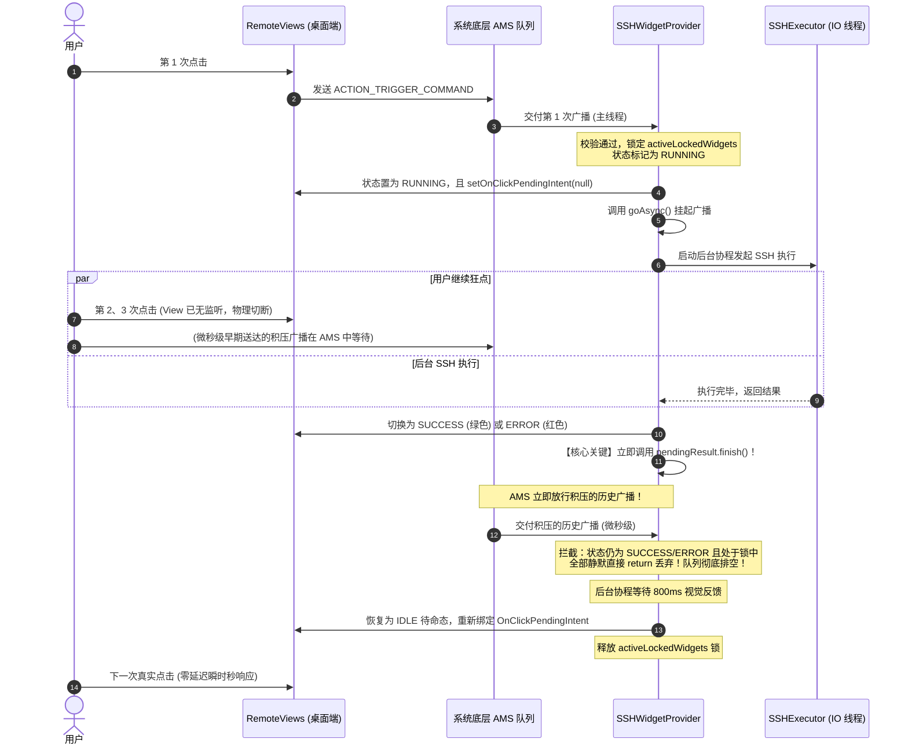

# 线程模型与组件生命周期 (Threading Model & Lifecycle)

[返回开发文档目录](README.md)

---

## 1. 协程与线程调度模型 (Coroutines Architecture)

本项目完全基于 Kotlin 协程构建，杜绝在主线程进行任何磁盘 IO、数据库查询与网络通信。

```mermaid
graph LR
    subgraph MainThread["Dispatchers.Main (UI / 主线程)"]
        UI_Observe[LiveData 数据监听]
        UI_Dialog[弹窗更新 / Toast 提示]
        Widget_RemoteViews[RemoteViews 图标与背景切换]
    end

    subgraph IOThread["Dispatchers.IO (工作线程池)"]
        Room_DB[Room DAO 增删改查]
        Keystore_Crypto[AES-256 加解密计算]
        SSH_Connect[TCP Socket 握手与连接]
        SSH_Exec[Session 创建与命令执行]
        Stream_Read[输出流读取与聚合]
    end

    UI_Observe -->|withContext / launch| IOThread
    IOThread -->|withContext(Dispatchers.Main)| MainThread
```

### 调度器分工
1. **`Dispatchers.Main`**：
   - 处理界面 RecyclerView 滚动、点击事件；
   - 展现 Material Dialogs 与 Toast 状态提醒；
   - 更新 RemoteViews 并向 `AppWidgetManager` 提交更新。
2. **`Dispatchers.IO`**：
   - 所有的 `SSHExecutor` 挂起函数（`executeCommand`、`testConnection`）显式标记为 `withContext(Dispatchers.IO)`，内部自带线程安全切换，调用方无需额外指定工作线程；
   - Room 数据库查询。

---

## 2. 桌面小部件 (AppWidget) 与 BroadcastReceiver 的生命周期处理

### Android 12+ 广播限制与后台设计
在 Android 8.0 ~ 14 中，Google 对后台 Service 和 BroadcastReceiver 施加了严格限制：
- 静态注册的 `BroadcastReceiver` 的 `onReceive` 必须在几秒内返回，禁止直接启动普通后台 Service；
- 若长时间占用 `onReceive` 主线程，系统会判定并触发 ANR。

### 协程作用域方案 (`App.applicationScope`)、`goAsync()` 与防并发机制
在 `SSHWidgetProvider` 中：
```kotlin
class SSHWidgetProvider : AppWidgetProvider() {
    companion object {
        // 内存级互斥锁：锁定整个【RUNNING -> 变色反馈 -> 彻底变回 IDLE】的全生命周期
        private val activeLockedWidgets = ConcurrentHashMap.newKeySet<Int>()
        // 硬件防抖时间戳（200ms）
        private val lastTriggerTimestamps = ConcurrentHashMap<Int, Long>()
    }
}
```
1. **进程级 `App.applicationScope`**：
   - 不在 BroadcastReceiver 实例内部创建单独的 CoroutineScope，而是统一交给 `App.applicationScope`（`SupervisorJob() + Dispatchers.Main`）托管，保证即使接收器实例被系统回收，异步网络通信与视图复原协程也不会被中途掐断。
2. **`goAsync()` 与 AMS 广播队列释放时机**：
   - 调用 `val pendingResult = goAsync()`，向 Android ActivityManager 注册异步广播生命周期，确保在网络通信期间进程不被系统视为空闲而提前休眠；
   - **关键时机**：网络请求结束后、UI 切换至变色反馈态的瞬间立即调用 `pendingResult.finish()`，绝不等待后续的视觉延迟。
3. **AlarmManager 硬件级唤醒复位**：
   - 传统 `delay()` 无法穿透系统的熄屏深度休眠（Deep Sleep）或进程被 LMK 冻结清理；
   - 本项目通过 `AlarmManager.setExactAndAllowWhileIdle` 结合 `ACTION_RESET_WIDGET_STATE` 广播，即便手机熄屏，系统级 Alarm 触发后必定唤醒设备并将小部件恢复至 `IDLE` 待命默认颜色。

---

## 3. 桌面小控件防并发与 AMS 广播队列防排队机制（核心复盘）

### 3.1 痛点与历史缺陷现象
* **现象 1（排队连环触发）**：用户在桌面上频繁连续按击小控件时，点击事件似乎被记录到队列里，在第 1 次执行完成后，紧接着执行第 2 次、第 3 次……导致脚本一直连续不停地执行。
* **现象 2（恢复待命后的滞涩延时）**：小控件变回默认颜色后，按下去无响应，需要等待几百毫秒后再次按下才起作用。

### 3.2 深度原因剖析（AMS BroadcastQueue 底层机制）
1. **AMS 静态广播队列的串行挂起特性**：
   - 当 Android 静态广播接收器通过 `goAsync()` 挂起时，AMS（ActivityManagerService）会将后续发往该接收器的所有广播在系统级队列中挂起等待，绝不并行派发。
   - 若为了等待前端视觉展示（如绿灯保持 800ms）而把 `pendingResult.finish()` 延迟到小组件恢复 `IDLE` 之后才调用，这期间用户的所有狂点都会被扣押在 AMS 系统队列中。
   - 一旦 `finish()` 释放，AMS 立即逐一释放积压的历史广播。此时由于组件刚好变回 `IDLE`，新收到的历史广播便误以为是用户的最新意图，从而引发排队连环执行。
2. **人工延时保护的负面体验**：
   - 若在复位后施加硬性的人工冷却（如 1 秒内禁止再触发），会导致用户在目视图标变回默认后正常点击却被拦截，产生严重的滞涩延时感。

### 3.3 三重防御体系解决方案



1. **物理层切断（桌面端解除监听）**：
   - 在 `WidgetManager.updateWidgetView()` 中，仅当 `state == WidgetState.IDLE` 时才绑定点击 `PendingIntent`。
   - 在 `RUNNING`、`SUCCESS`、`ERROR` 状态下，将 RemoteViews 的 `setOnClickPendingIntent` 显式设为 `null`，桌面端完全失去点击监听，物理上杜绝新 Intent 的生成。
2. **提前结束广播（AMS 即时泄洪与静默丢弃）**：
   - 网络请求一结束、UI 刚切换为绿色/红色的瞬间，**立即调用 `pendingResult.finish()` 结束广播**。
   - AMS 中积压的残留广播在此时被倾泻交付给 App，但由于当前状态**依然是 SUCCESS/ERROR 且处于互斥锁中**，所有积压广播会在 0.1ms 内被前置逻辑全部静默丢弃，彻底排空系统队列。
3. **零延迟待命响应**：
   - 视觉延迟（800ms / 2000ms）在独立协程中等待；恢复为 `IDLE` 态的瞬间立即解开内存锁并重新激活桌面点击。
   - 彻底移除了人为设置的复位延时死区，仅保留 200ms 的硬件微小防抖，实现用户在图标恢复默认后“秒点秒触发”的丝滑手感。

---

## 4. UI 生命周期与内存防泄漏 (Memory Leak Prevention)

### Fragment ViewBinding 生命周期规范
在 `CommandsFragment`、`ServersFragment`、`KeysFragment` 中均严格遵循 Android 官方的 ViewBinding 释放规范：
```kotlin
private var _binding: FragmentCommandsBinding? = null
private val binding get() = _binding!!

override fun onCreateView(inflater: LayoutInflater, container: ViewGroup?, savedInstanceState: Bundle?): View {
    _binding = FragmentCommandsBinding.inflate(inflater, container, false)
    return binding.root
}

override fun onDestroyView() {
    super.onDestroyView()
    // 必须在 onDestroyView 中置 null，防止 Fragment View 销毁后仍被 binding 强引用导致内存泄露
    _binding = null
}
```

### 协程生命周期绑定 (`viewLifecycleOwner.lifecycleScope`)
- 在 Fragment 中发起的所有数据操作（如弹窗保存、删除确认）均绑定在 `viewLifecycleOwner.lifecycleScope` 上；
- 用户如果在网络请求中快速切换 Tab 或退出当前页面，关联的协程会自动取消，杜绝空指针与 View 泄露。

---

## 5. 进程销毁与页面状态恢复 (Process Death & State Restoration)

### 后台长驻进程被杀（Activity Recreation）导致的页面冻结问题
当 App 在后台放置时间较长时，Android 系统由于低内存机制（Low Memory Killer）会杀死后台应用进程。当用户再次从任务栈调出 App 时：
1. **现象**：
   - 界面停留在之前展示的页面，无论如何点击底部导航栏各个 Tab，页面卡住无法切换。
2. **根因剖析**：
   - `MainActivity` 重新执行 `onCreate(savedInstanceState)`；
   - 系统 `FragmentManager` 会自动恢复并挂载销毁前的老 Fragment 实例到布局容器中；
   - 若 Activity 仅在成员变量处硬编码 `private val commandsFragment = CommandsFragment()`，由于 `savedInstanceState != null`，这些新实例**从未被添加到 FragmentManager 中**；
   - 用户点击底部导航触发 `show(target) / hide(activeFragment)` 时，操作的是未挂载的孤立实例，而在屏幕上渲染的恢复实例始终未被修改，导致 UI 彻底冻结。
3. **彻底解决方案**：
   - 在 `onCreate` 中增加分支判断：当 `savedInstanceState != null` 时，通过 `supportFragmentManager.findFragmentByTag(TAG)` 重新认领系统恢复出来的真实实例；
   - 在 `onSaveInstanceState(outState)` 中持久化当前激活页面的 Tag；
   - 恢复时统一同步各 Fragment 的 `show/hide` 状态及底部导航栏选中的 Tab，保证无论在后台挂置多久，恢复后均能丝滑切换。

